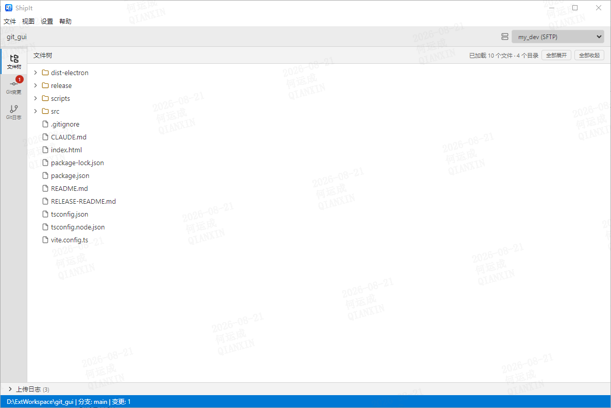
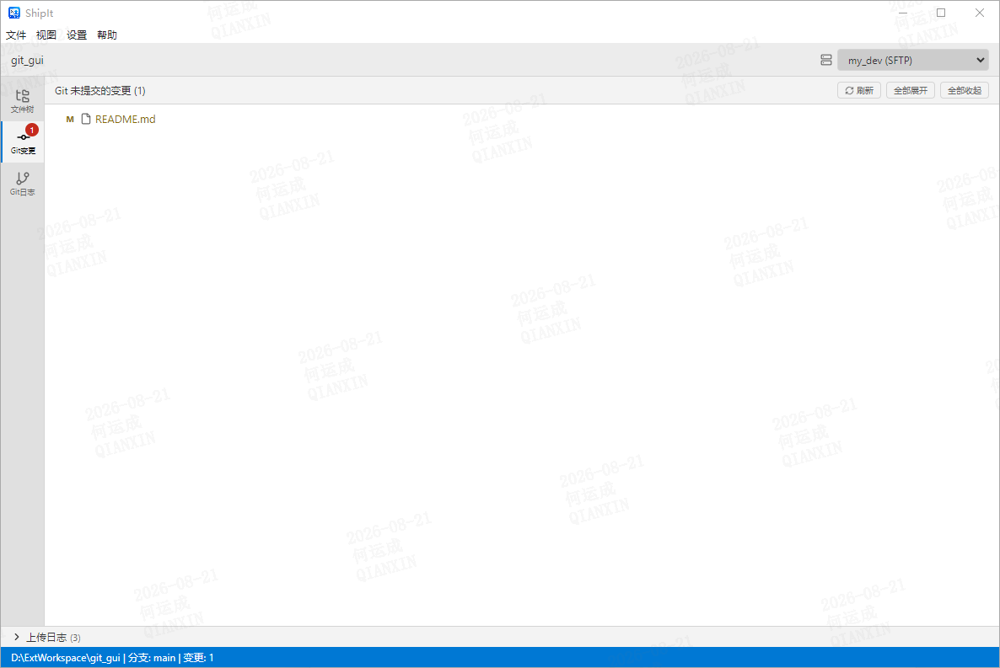
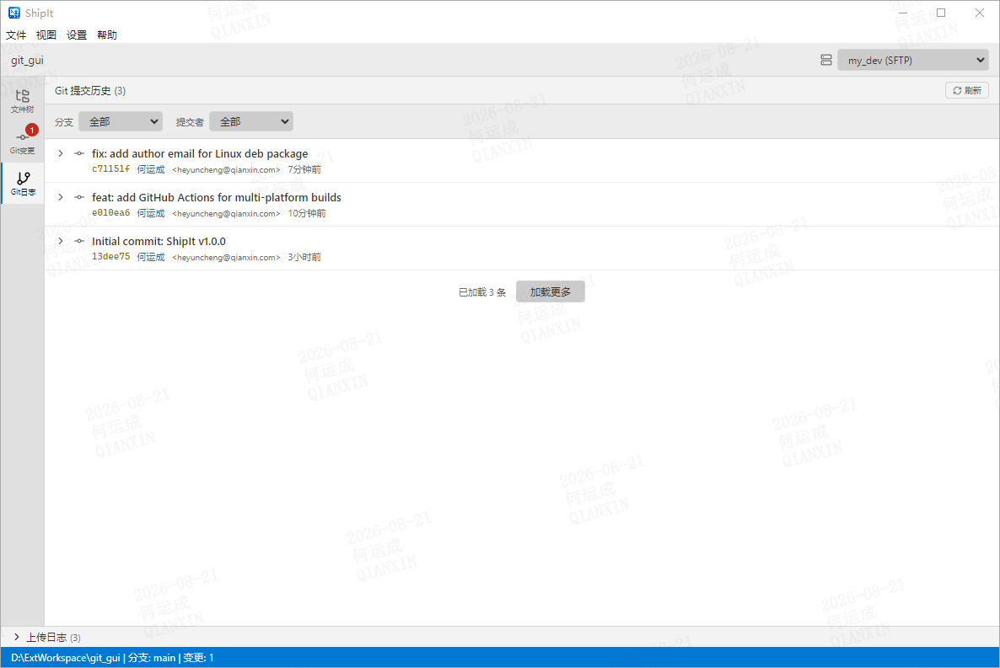

# ShipIt

面向开发者的文件发布工具 —— 将本地文件通过 SFTP/FTP/FTPS/FTPES/本地目录一键上传到多台服务器，集成 Git 变更与提交历史查看。

## 功能特性

- **三视图切换**：文件树 / Git 未提交变更 / Git 提交历史
- **多目标上传**：支持 SFTP/FTP/FTPS/FTPES/本地目录，每个目标独立配置连接与目录映射
- **上传链路**：选中文件 → 确认弹窗 → 进度条（可取消）→ 底部日志
- **Git 集成**：查看变更、提交历史，一键上传提交文件
- **主题**：自动跟随系统 / 深色 / 亮色
- **无障碍**：键盘可达、焦点环、ARIA 标签

## 下载

[📥 下载最新版 ShipIt](../../releases/latest)

### 系统要求

- Windows 10 或更高版本（64 位）
- 无需安装 .NET Framework

### 安装

1. 下载 `ShipIt-vX.X.X-buildXXXXXXXX-x64.exe`
2. 双击运行安装程序
3. 选择安装目录，完成安装

## 使用说明

### 1. 打开项目

菜单 `文件 → 打开目录`（Ctrl+O）选择任意本地目录。

### 2. 配置上传目标

`设置 → 上传目标管理`（Ctrl+,）添加目标：
- 选择协议（SFTP/FTP/FTPS/FTPES/本地目录）
- 填写主机、端口、用户名、密码/密钥
- 配置**目录映射**（本地前缀 → 远端路径）

### 3. 上传文件

文件树 / Git 变更中右键或点击"快速上传" → 选择目标 → 确认弹窗 → 上传 → 底部日志查看结果。

## 快捷键

| 快捷键 | 功能 |
|--------|------|
| `Ctrl+O` | 打开目录 |
| `Ctrl+Shift+O` | 打开工作目录 |
| `Ctrl+1` | 文件树视图 |
| `Ctrl+2` | Git 变更视图 |
| `Ctrl+3` | Git 日志视图 |
| `Ctrl+,` | 上传目标管理 |
| `Ctrl+W` | 关闭项目 |
| `Esc` | 关闭弹窗 |

## 截图

### 文件树视图

浏览项目文件结构，选择文件进行上传。

### Git 变更视图

查看未提交的 Git 变更，快速上传修改的文件。

### Git 提交历史

浏览提交历史，一键上传提交的文件。

## 反馈

如有问题或建议，请 [提交 Issue](../../issues)。

## 许可证

版权所有 © 2026。保留所有权利。
